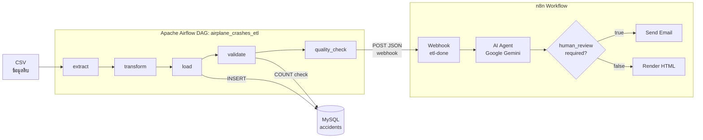

# ✈️ Airplane Crashes ETL Pipeline & Agentic AI

โครงงาน Mini-project — **การจัดการข้อมูลอากาศยานเกิดอุบัติเหตุ เพื่อพัฒนาต้นแบบการวิเคราะห์ความปลอดภัยด้านนิรภัยการบินของกองทัพอากาศ**

> โครงการ Upskill/Reskill 2569 — หลักสูตรการขับเคลื่อนธุรกิจด้วยข้อมูล
> **Module 2: Data Engineering** — PSU Software Development Engineering Center (ศูนย์วิศวกรรมการพัฒนาซอฟต์แวร์ ม.อ.)


---

## 📑 สารบัญ

- [ภาพรวมโครงงาน](#-ภาพรวมโครงงาน)
- [สถาปัตยกรรมระบบ](#-สถาปัตยกรรมระบบ)
- [ชุดข้อมูลที่ใช้](#-ชุดข้อมูลที่ใช้)
- [โครงสร้างโปรเจกต์](#-โครงสร้างโปรเจกต์)
- [ความต้องการของระบบ](#-ความต้องการของระบบ)
- [การติดตั้งและใช้งาน](#-การติดตั้งและใช้งาน)
- [รายละเอียด ETL Pipeline](#-รายละเอียด-etl-pipeline)
- [Data Cleansing & Transformation](#-data-cleansing--transformation)
- [ฐานข้อมูล (Database Schema)](#-ฐานข้อมูล-database-schema)
- [ตัวอย่างการวิเคราะห์ (Query)](#-ตัวอย่างการวิเคราะห์-query)
- [Agentic AI สำหรับตรวจสอบคุณภาพข้อมูล](#-agentic-ai-สำหรับตรวจสอบคุณภาพข้อมูล)
- [รายงานคุณภาพข้อมูล (Quality Report)](#-รายงานคุณภาพข้อมูล-quality-report)
- [Notebooks](#-notebooks)
- [หมายเหตุและข้อจำกัด](#-หมายเหตุและข้อจำกัด)

---

## 🎯 ภาพรวมโครงงาน

โครงงานนี้สร้างระบบ **Data Pipeline แบบครบวงจร (End-to-End)** สำหรับข้อมูลอุบัติเหตุการบินทั่วโลกตั้งแต่ปี ค.ศ. 1908 โดยมีเป้าหมายเพื่อ:

1. **ทำความสะอาดข้อมูล (Data Cleansing)** — จัดการค่าที่หายไป ค่าผิดปกติ และมาตรฐานข้อมูล
2. **แปลงและสร้างฟีเจอร์ (Transformation)** — เพิ่มมิติวิเคราะห์ เช่น ทศวรรษ อัตรารอดชีวิต ประเทศ
3. **โหลดเข้าฐานข้อมูล (Load)** — จัดเก็บลง MySQL เพื่อใช้ Query วิเคราะห์
4. **อัตโนมัติด้วย Airflow** — จัดตารางและควบคุมลำดับงานผ่าน DAG
5. **ตรวจสอบคุณภาพด้วย Agentic AI** — ส่งรายงานคุณภาพให้ AI Agent วิเคราะห์และแจ้งเตือนอัตโนมัติ

---

## 🏗️ สถาปัตยกรรมระบบ



**เทคโนโลยีหลัก**

| ชั้น | เทคโนโลยี |
|------|-----------|
| Orchestration | Apache Airflow 2.9.0 (CeleryExecutor) |
| Runtime | Docker Compose — Airflow + PostgreSQL + Redis |
| Data Processing | Python, pandas, numpy |
| Database | MySQL (ฐานข้อมูล `accidents`) |
| Agentic AI | n8n + Google Gemini (`gemini-flash-lite`) |
| Notification | Email (SMTP) / HTML report |

---

## 📊 ชุดข้อมูลที่ใช้

| หัวข้อ | รายละเอียด |
|--------|------------|
| **ชื่อชุดข้อมูล** | Airplane Crashes and Fatalities Since 1908 |
| **ขนาด (ดิบ)** | 4,967 แถว × 17 คอลัมน์ |
| **ช่วงเวลา** | ค.ศ. 1908–2019 |
| **ผู้เสียชีวิตรวม** | 110,775 ราย |
| **แหล่งที่มา** | ชุดข้อมูลสาธารณะจาก Kaggle (ต้นทาง planecrashinfo.com) |
| **รูปแบบไฟล์** | CSV — `data/Airplane_Crashes_and_Fatalities_Since_1908_20190820105639.csv` |

**คอลัมน์ต้นฉบับ:** `Date, Time, Location, Operator, Flight #, Route, AC Type, Registration, cn/ln, Aboard, Aboard Passangers, Aboard Crew, Fatalities, Fatalities Passangers, Fatalities Crew, Ground, Summary`

---

## 📁 โครงสร้างโปรเจกต์

```
airflow-training-lab/
├── dags/
│   └── airplane_crashes_etl.py     # Airflow DAG หลัก (Extract→Transform→Load→Validate→Quality Check)
├── notebooks/
│   ├── 01_Data_Analysis.ipynb      # EDA + Cleansing ต้นฉบับ + Visualization
│   ├── 02_Handle_Connection_Errors.ipynb  # ทดสอบการเชื่อมต่อ MySQL
│   ├── 03_mysql_Create_Tables.ipynb       # สร้างฐานข้อมูลและตาราง accidents
│   ├── 04_mysql_Load_Data.ipynb           # โหลด CSV ที่ทำความสะอาดแล้วเข้า MySQL
│   └── 05_mysql_Query_Data.ipynb          # ตัวอย่าง Query วิเคราะห์
├── n8n/
│   └── Airplane_crashes_workflow.json     # n8n workflow (AI Agent วิเคราะห์คุณภาพ)
├── data/
│   ├── Airplane_Crashes_..._20190820105639.csv  # ข้อมูลดิบ
│   ├── airplane_crashes_cleaned.csv             # ข้อมูลที่ทำความสะอาดแล้ว
│   └── etl_quality_report.json                  # รายงานคุณภาพข้อมูลล่าสุด
├── config/  logs/  plugins/       # โฟลเดอร์มาตรฐานของ Airflow
├── docker-compose.yaml            # นิยาม service ทั้งหมด
├── .env                           # ตัวแปรสภาพแวดล้อม (UID / user / pip requirements)
└── README.md
```


---

## ⚙️ ความต้องการของระบบ

- **Docker** และ **Docker Compose** (แนะนำ RAM ≥ 4GB, CPU ≥ 2 cores)
- **MySQL Server** ทำงานบนเครื่อง host (พอร์ต 3306) พร้อมฐานข้อมูล `accidents`
- **n8n** ทำงานบนเครื่อง host (พอร์ต 5678) — สำหรับส่วน Agentic AI (ไม่บังคับ)
- Python 3.x + `pandas`, `numpy`, `mysql-connector-python` (สำหรับรัน notebooks นอก container)

---

## 🚀 การติดตั้งและใช้งาน

### 1) เตรียมฐานข้อมูล MySQL

รัน notebook [`notebooks/03_mysql_Create_Tables.ipynb`](notebooks/03_mysql_Create_Tables.ipynb) เพื่อสร้างฐานข้อมูล `accidents` และตาราง `accidents`

### 2) เริ่มระบบ Airflow ด้วย Docker Compose

```bash
# 1. เริ่มต้นฐานข้อมูลและสร้าง user เริ่มต้น
docker compose up airflow-init

# 2. เมื่อขึ้น "airflow-init completed" แล้ว รันทั้งระบบแบบ background
docker compose up -d
```

### 3) เข้าใช้งาน Airflow Web UI

- เปิดเบราว์เซอร์ไปที่ **http://localhost:8080**
- Username / Password เริ่มต้น: `airflow` / `airflow` (กำหนดใน `.env`)
- เปิดใช้งาน (unpause) DAG **`airplane_crashes_etl`** แล้วสั่ง Trigger

### 4) (ไม่บังคับ) ตั้งค่า Agentic AI ด้วย n8n

- Import ไฟล์ [`n8n/Airplane_crashes_workflow.json`](n8n/Airplane_crashes_workflow.json) เข้า n8n
- ตั้งค่า credential ของ Google Gemini และ SMTP
- Activate workflow (webhook path: `etl-done`)

---

## 🔄 รายละเอียด ETL Pipeline

ไฟล์: [`dags/airplane_crashes_etl.py`](dags/airplane_crashes_etl.py)

| คุณสมบัติ DAG | ค่า |
|---------------|-----|
| `dag_id` | `airplane_crashes_etl` |
| `schedule_interval` | `@daily` (รันทุกวัน) |
| `catchup` | `False` |
| `retries` | 1 (หน่วงลองใหม่ 2 นาที) |
| `tags` | `capstone`, `etl`, `airplane` |

**ลำดับงาน (Task Dependencies):**

```
extract → transform → load → validate → quality_check
```

| Task | หน้าที่ |
|------|---------|
| **extract** | อ่านไฟล์ CSV ดิบ และบันทึกจำนวนแถวผ่าน XCom |
| **transform** | ทำความสะอาด + สร้างฟีเจอร์ใหม่ → บันทึก `airplane_crashes_cleaned.csv` |
| **load** | `TRUNCATE` ตาราง แล้ว `executemany` ทีละ 500 แถว (แปลง NaN/NaT → NULL) |
| **validate** | นับจำนวนแถวในตาราง หากว่าง (0 แถว) จะ raise error |
| **quality_check** | สร้างรายงานคุณภาพข้อมูล (JSON) + ส่ง POST ไป n8n webhook |

---

## 🧹 Data Cleansing & Transformation

### เทคนิคการทำความสะอาด (Cleansing)

1. **การจัดการค่าที่หายไป (Missing Values)**
   - เติม `"Unknown"`: `Flight #`, `Route`, `cn/ln`, `Operator`
   - เติม `"00:00"`: `Time` | เติม `0`: `Ground`
   - เติม **ค่ามัธยฐาน (median)**: `Aboard`, `Fatalities`
   - เติม `"No summary available"`: `Summary`
   - **ตัดแถว** ที่ไม่มี `Date` หรือ `Location` (4 แถว)

2. **การจัดรูปแบบให้เป็นมาตรฐาน (Standardization)**
   - `strip().title()` กับ `Operator`, `Location`, `AC Type`
   - รวมชื่อหน่วยงานทหารที่สะกดต่างกัน (ใน notebook 01) → `US Air Force` / `US Army` / `US Navy`

3. **การแก้ค่าผิดปกติ/ตรรกะ (Outlier & Logic)**
   - แก้กรณี `Fatalities > Aboard` ให้เท่ากับ `Aboard`
   - ตรวจสอบข้อมูลซ้ำ (duplicate) — พบ 0 แถว

### ฟีเจอร์ที่สร้างเพิ่ม (Feature Engineering)

`Year`, `Month`, `Decade`, `Survivors`, `Survival_Rate`, `Fatality_Rate`, `Country`

> **ผลลัพธ์:** 4,967 → **4,963 แถว** (ตัดออก 4 แถว, ระดับความรุนแรง = LOW)

---

## 🗄️ ฐานข้อมูล (Database Schema)

**ตาราง `accidents`** (`ENGINE=InnoDB`) — `acc_id` เป็น Primary Key (`AUTO_INCREMENT`) + 20 คอลัมน์ข้อมูล

| คอลัมน์ | ชนิด | หมายเหตุ |
|---------|------|----------|
| `acc_id` | INT (AUTO_INCREMENT) | Primary Key |
| `date` | DATE | NOT NULL |
| `time` | TIME | NOT NULL |
| `location` | TEXT | NOT NULL |
| `operator` | TEXT | NOT NULL |
| `flight_no` | VARCHAR(30) | |
| `route` | VARCHAR(100) | |
| `ac_type` | VARCHAR(100) | |
| `registration` | VARCHAR(20) | |
| `cn_ln` | VARCHAR(20) | |
| `aboard` | INT | NOT NULL |
| `fatalities` | INT | |
| `ground` | INT | |
| `summary` | TEXT | NOT NULL |
| `year` | INT | NOT NULL |
| `month` | INT | NOT NULL |
| `decade` | VARCHAR(5) | NOT NULL |
| `survivors` | INT | |
| `survival_rate` | FLOAT | |
| `fatality_rate` | FLOAT | |
| `country` | VARCHAR(50) | |

**เหตุผลที่เลือกใช้ MySQL:** เป็นฐานข้อมูลเชิงสัมพันธ์ โครงสร้างชัดเจน รองรับ SQL วิเคราะห์ และเชื่อมกับขั้น Load ของ Airflow ได้โดยตรง

---

## 📈 ตัวอย่างการวิเคราะห์ (Query)

ดูตัวอย่างเต็มใน [`notebooks/05_mysql_Query_Data.ipynb`](notebooks/05_mysql_Query_Data.ipynb)

**สายการบิน/หน่วยงานที่เกิดอุบัติเหตุสูงสุด 10 อันดับ**

| Operator | จำนวน |
|----------|-------|
| Aeroflot | 254 |
| US Air Force | 140 |
| Air France | 72 |
| Deutsche Lufthansa | 62 |
| United Air Lines | 44 |

**ชนิดอากาศยานที่เกิดอุบัติเหตุสูงสุด**

| AC Type | จำนวน |
|---------|-------|
| Douglas DC-3 | 332 |
| DHC-6 Twin Otter 300 | 81 |
| Douglas C-47A | 70 |

---

## 🤖 Agentic AI สำหรับตรวจสอบคุณภาพข้อมูล

ไฟล์: [`n8n/Airplane_crashes_workflow.json`](n8n/Airplane_crashes_workflow.json)

เมื่อ task `quality_check` ทำงานเสร็จ จะส่งรายงานคุณภาพข้อมูล (JSON) ผ่าน HTTP POST ไปยัง n8n webhook (`etl-done`) จากนั้น:

```
Webhook (etl-done)
   → AI Agent (Google Gemini flash-lite, temperature=0)  # บทบาท "Data Quality Analyst"
      → If (human_review_required)
          ├─ true  → Send Email (SMTP) แจ้งเตือน
          └─ false → Render HTML report
```

**กติกาการตัดสินใจของ AI Agent (Decision Rule):**
- ตอบ **ALERT** เมื่อ: `severity = HIGH` หรือ `human_review_required = true` หรือพบ logic error (`fatalities_gt_aboard > 0` หรือ `negative_fatalities > 0`) หรือ `rejected_rows > 10%`
- ตอบ **OK** เมื่อข้อมูลอยู่ในเกณฑ์ปกติ

---

## 📋 รายงานคุณภาพข้อมูล (Quality Report)

ตัวอย่างจาก [`data/etl_quality_report.json`](data/etl_quality_report.json):

```json
{
  "pipeline": "airplane_crashes_etl",
  "total_rows": 4967,
  "valid_rows": 4963,
  "rejected_rows": 4,
  "is_duplicate": 0,
  "invalid_date": 0,
  "missing_operator": 10,
  "missing_location": 4,
  "missing_aboard": 18,
  "negative_fatalities": 0,
  "invalid_year": 0,
  "fatalities_gt_aboard": 0,
  "severity": "LOW",
  "human_review_required": false
}
```

**ตรรกะการประเมิน severity:** อิงสัดส่วน `rejected_rows / total_rows` — `> 20%` = HIGH, `> 5%` = MEDIUM, มิฉะนั้น = LOW

---

## 📓 Notebooks

| Notebook | เนื้อหา |
|----------|---------|
| [`01_Data_Analysis.ipynb`](notebooks/01_Data_Analysis.ipynb) | EDA, cleansing ต้นฉบับ, feature engineering, และกราฟวิเคราะห์ (อุบัติเหตุต่อปี, ผู้เสียชีวิตต่อทศวรรษ, อัตรารอดชีวิต, Top 10 Operators/AC Types) |
| [`02_Handle_Connection_Errors.ipynb`](notebooks/02_Handle_Connection_Errors.ipynb) | ตัวอย่างการจัดการ error การเชื่อมต่อ MySQL |
| [`03_mysql_Create_Tables.ipynb`](notebooks/03_mysql_Create_Tables.ipynb) | สร้างฐานข้อมูล `accidents` และตาราง |
| [`04_mysql_Load_Data.ipynb`](notebooks/04_mysql_Load_Data.ipynb) | โหลด CSV ที่ทำความสะอาดแล้วเข้า MySQL (batch insert) |
| [`05_mysql_Query_Data.ipynb`](notebooks/05_mysql_Query_Data.ipynb) | ตัวอย่าง Query วิเคราะห์ข้อมูล |

---

## ⚠️ หมายเหตุและข้อจำกัด

- **การตั้งค่าเป็นแบบ hardcode ใน DAG** — `MYSQL_CONF` และ `N8N_WEBHOOK_URL` เขียนไว้ในโค้ดโดยตรง ยังไม่ได้ใช้ Airflow Connections/Variables (เหมาะกับการเรียนรู้ ไม่แนะนำสำหรับ production)
- **MySQL อยู่บนเครื่อง host** — DAG เชื่อมต่อผ่าน `host.docker.internal` ด้วย user `root` และรหัสผ่านว่าง (ค่าเริ่มต้นสำหรับการทดลอง)
- **n8n workflow ตั้งค่า `active: false`** — ต้อง activate เองก่อนใช้งาน และต้องตั้ง credential (Gemini API, SMTP)
- **quality_check ตรวจบนข้อมูลดิบ** — เพื่อรายงานปัญหาที่พบ *ก่อน* การ cleansing
- `docker-compose.yaml` ตั้ง `AIRFLOW__CORE__LOAD_EXAMPLES: 'true'` แต่ถูก override เป็น `false` ผ่าน `.env`

---
